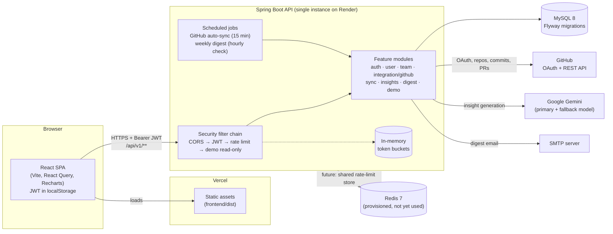
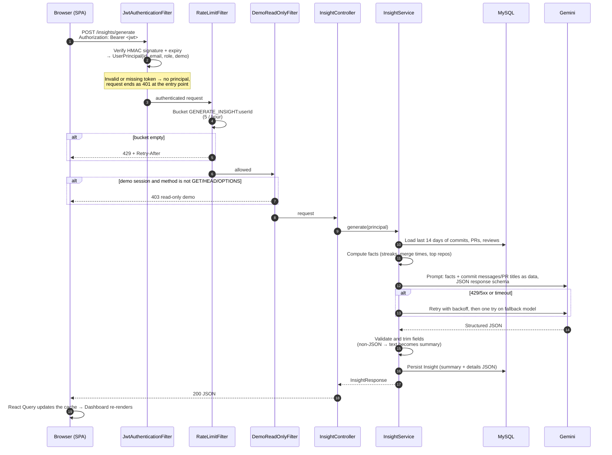

# DevPulse Architecture

This document describes how DevPulse is put together: the main components, how one request travels through them,
and the decisions behind the shape of the system. For setup and endpoint reference, see [README.md](README.md).

## Components

| Component | Responsibility |
| --- | --- |
| **React SPA** (`frontend/`) | Landing, auth, Dashboard, Team, People, Settings. Talks to the API through one Axios client (`src/api/client.ts`) that attaches the bearer token and clears the session on 401. |
| **Security filter chain** (`common/security`, `common/ratelimit`, `demo/DemoReadOnlyFilter`) | Stateless. Verifies the JWT, throttles costly endpoints, and blocks writes from demo sessions. |
| **auth / user / team** | Registration, login, demo sign-in, role-scoped team management (`ADMIN` > `MANAGER` > `MEMBER`), and team activity aggregates. |
| **integration/github + sync** | OAuth connection (tokens AES-encrypted at rest), and incremental, idempotent commit/PR/review sync. |
| **insights** | Computes activity facts from MySQL, then asks Gemini for schema-constrained highlights, patterns and suggestions. |
| **digest** | Weekly personal and team email, claimed per user in the database so it never goes out twice. |
| **demo** | Seeds a read-only sample team when `DEMO_ENABLED=true`. |
| **MySQL** | The only system of record: users, GitHub accounts, OAuth states, commits, PRs, insights, digest claims. |
| **Redis** | Started by `docker-compose.yml` but not used by the backend yet. See [ADR-2](#adr-2-redis-reserved-for-shared-ephemeral-state). |

The backend is a **modular monolith**. Each feature package has `api` (controllers, DTOs), `service`, `domain`
and `persistence` sub-packages. Modules call each other's services directly, not over the network.

## Request flow

Below is `POST /api/v1/insights/generate`. It uses every layer: authentication, rate limiting, the demo guard,
the database, and an external AI call with retries.

Most requests are simple reads like `GET /team/activity`. They follow the same filter path and skip the external
call. Role scoping (who can see whom) is applied in the service layer and comes from the principal's role, so no
extra lookup is needed.

Background work follows the same pattern without an HTTP request. `GitHubAutoSync` and `WeeklyDigestSender` run on
Spring's scheduler thread and call the same services as the controllers.

## Decision records

Each record is short: the context, the decision, and the consequences we accept.

### ADR-1: Stateless JWT access tokens

**Context.** The SPA and API live on different origins (Vercel and Render). The API should hold no session state,
so it can restart (the free instance sleeps when idle) or run as several copies without logging anyone out.

**Decision.** On login, the API issues an HMAC-signed JWT (jjwt, `JWT_SECRET` ≥ 32 bytes) that lasts 8 hours. Its
claims are `sub` (user id), `email`, `role` and `demo`. `JwtAuthenticationFilter` turns the token into a
`UserPrincipal` without touching the database. The session policy is `STATELESS`. CSRF protection is off because
auth goes in an `Authorization` header, not a cookie.

**Consequences.**
- Authenticating a request needs no DB or cache lookup, and any instance can verify any token.
- The role is baked into the token, so a role change applies **at the next sign-in**. The README documents this.
- Tokens can't be revoked. A deactivated user's token works until it expires. If that becomes unacceptable, the
  options are shorter tokens with a refresh token, or a deny-list (a natural first use for Redis).
- The SPA keeps the token in `localStorage`, so an XSS bug could read it. We accept this in exchange for simple
  cross-origin auth. Moving to an `HttpOnly` cookie would mean turning CSRF protection back on.

### ADR-2: Redis reserved for shared, ephemeral state

**Context.** Rate limiting (bucket4j) currently keeps one token bucket per `(rule, key)` in a
`ConcurrentHashMap`. That works on one instance. With two instances, each would allow the full limit, so the real
limit doubles. Redis is already part of the local stack (`docker-compose.yml`, AOF persistence) but the backend
doesn't depend on it.

**Decision.** For now, keep MySQL as the only required datastore and keep buckets in memory. **When the API runs as
more than one instance, move the buckets to Redis** using `bucket4j-redis`. Redis over MySQL for this because:
- Rate-limit checks run on every throttled request and need atomic compare-and-set with expiry. Redis does this in
  memory with TTLs; in MySQL it would mean row locks and cleanup jobs.
- The data is disposable. Losing it at worst resets someone's limit, so it doesn't belong in the system of record.
- Other short-lived shared state could use the same store later: a JWT deny-list (ADR-1), short-TTL caching of
  `/team/activity` aggregates, and possibly OAuth `state` values (which live in MySQL today).

**Consequences.** Hosted deployments (Render free plan) need only MySQL today, with one fewer service to pay for and
monitor. The cost is that rate limits are per instance, and they reset when the instance restarts. That is
documented in the README and in `RateLimiter`'s Javadoc.

### ADR-3: Modular monolith on MySQL with Flyway

**Context.** One small team builds DevPulse, and it deploys to a single free-tier container. The features (sync,
insights, digest, team views) all read the same tables.

**Decision.** One Spring Boot service, split into feature packages, on one MySQL 8 schema. Flyway owns the schema
(`V1`…`V9`), and Hibernate runs with `ddl-auto: validate`, so the app refuses to start if the entities and the
schema disagree. Bulk sync writes use JDBC batching (`batch_size: 100`, `rewriteBatchedStatements`).

**Consequences.** Cross-feature queries are plain SQL joins with no network calls between services, and one deploy
ships everything. If a module ever needs to scale on its own (most likely sync), its package boundaries mark where
to cut it out. Splitting it out would also mean replacing direct service calls with a queue.

### ADR-4: How it scales

**What already works with more than one instance:**

| Concern | Mechanism |
| --- | --- |
| Authentication | Stateless JWT (ADR-1). Any instance verifies any token. |
| OAuth handshake | The `state` lives in MySQL, is single-use and expires after 10 minutes, so the callback can land on any instance. |
| Weekly digest | Each recipient is claimed with an atomic `UPDATE ... WHERE` in MySQL before sending, so concurrent schedulers never email anyone twice. A failed send releases the claim. |
| Auto-sync | Several instances may occasionally sync the same account at once. That's harmless because commit inserts skip known SHAs and PRs are upserted. Unique keys (`repo_id, sha` and `account_id, pr_id, relation`) back this up. |

**What has to change, in order:**

1. **More API instances.** Move rate-limit buckets to Redis (ADR-2). Without that, it's the only thing that breaks.
   Sticky sessions aren't needed.
2. **Database load.** The dashboard and team views aggregate commits and PRs over 1–90 day windows. Commits are
   indexed on `(github_repo_id, authored_at)`. Before adding read replicas, profile the team queries, which fan out
   across every member's repos, and consider caching team aggregates in Redis for a few minutes.
3. **External quotas, which hit before CPU does.** GitHub allows 5,000 REST requests/hour per token and has a
   lower search limit. Auto-sync already caps each run at 25 accounts and 60 review lookups per sync, and moves the
   PR window forward only once a sync completes. Gemini calls are user-triggered and limited to 5/hour per user,
   with retry and a fallback model. At larger scale, sync would move from the in-process scheduler to a job queue
   with per-token backoff. Instances would then be split into web and worker roles.
4. **Scheduled jobs across many instances.** The jobs are safe to run concurrently, as shown above, but each
   instance repeats the scan. Past a handful of instances, add a scheduler lock such as ShedLock on MySQL or
   Redis, so only one instance scans per interval.

**Current footprint:** one 512 MB container (`-XX:MaxRAMPercentage=70 -XX:+UseSerialGC`) and one hosted MySQL. That
is enough for a demo and for small teams. Cold starts after idle take up to a minute.
